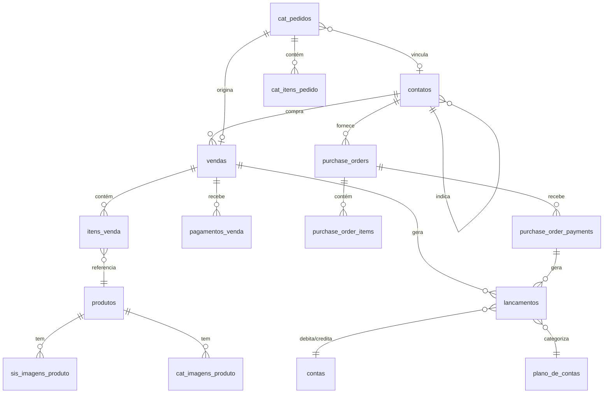

# Arquitetura do Banco de Dados — Mont Distribuidora

> **Documento de referência.** Descreve o estado atual do banco após os Sprints 1–4.
> Projeto Supabase: `herlvujykltxnwqmwmyx` (compartilhado com `catalogo-mont`).
> Última atualização: 2026-03-15.

---

## 1. Visão geral

O banco é um PostgreSQL gerenciado pelo Supabase com Row Level Security (RLS) habilitado em todas as tabelas. Existem **18 tabelas**, **~25 views** e **22 funções/RPCs** no schema `public`.

O sistema tem dois domínios:

- **Distribuidora** (`vendas`, `contatos`, `lancamentos`, `contas`, `produtos`, …) — sistema de gestão interno
- **Catálogo** (`cat_pedidos`, `cat_itens_pedido`, `cat_imagens_produto`, …) — loja pública, compartilhada com o projeto `catalogo-mont`

Pedidos do catálogo viram vendas na distribuidora automaticamente via trigger quando status → `'entregue'`.



---

## 2. Tabelas

### 2.1 `contatos` — 417 linhas

Clientes, fornecedores e leads. Tabela central do CRM.

| Coluna | Tipo | Nulável | Default | Notas |
|---|---|---|---|---|
| `id` | `uuid` | NO | `gen_random_uuid()` | PK |
| `nome` | `text` | NO | — | — |
| `telefone` | `text` | NO | — | UNIQUE — chave de vinculação com cat_pedidos |
| `tipo` | `text` | NO | — | `'cliente'`, `'fornecedor'`, `'lead'` |
| `subtipo` | `text` | YES | — | — |
| `status` | `text` | NO | `'lead'` | `'lead'`, `'ativo'`, `'inativo'` |
| `origem` | `text` | NO | `'direto'` | `'direto'`, `'indicacao'`, `'catalogo'` |
| `indicado_por_id` | `uuid` | YES | — | FK → `contatos.id` (auto-referência) |
| `endereco`, `bairro`, `logradouro`, `numero`, `complemento`, `cidade`, `uf`, `cep` | `text` | YES | — | Endereço completo |
| `latitude`, `longitude` | `float8` | YES | — | Geolocalização |
| `apelido` | `text` | YES | — | — |
| `observacoes` | `text` | YES | — | — |
| `ultimo_contato` | `timestamptz` | YES | — | — |
| `fts` | `tsvector` | YES | — | Índice GIN para busca full-text |
| `criado_em` | `timestamptz` | NO | `now()` | — |
| `atualizado_em` | `timestamptz` | NO | `now()` | Atualizado por trigger |
| `created_by`, `updated_by` | `uuid` | YES | — | Auditoria via `handle_audit_fields` |

**Índices:** `telefone` (UNIQUE), `indicado_por_id`, `status`, `tipo`, `fts` (GIN), `created_by`, `updated_by`.

**RLS:** SELECT livre para autenticados; INSERT livre para público; UPDATE livre para autenticados; DELETE/admin apenas via `is_admin()`.

---

### 2.2 `vendas` — 632 linhas

Pedidos de venda. Núcleo financeiro do sistema.

| Coluna | Tipo | Nulável | Default | Notas |
|---|---|---|---|---|
| `id` | `uuid` | NO | `gen_random_uuid()` | PK |
| `contato_id` | `uuid` | NO | — | FK → `contatos.id` (NO ACTION) |
| `data` | `date` | NO | `CURRENT_DATE` | Data da venda (sem hora) |
| `data_entrega` | `date` | YES | — | Data de entrega prevista |
| `data_prevista_pagamento` | `date` | YES | — | Usado no breakdown de a receber |
| `total` | `numeric` | NO | — | Total com taxa de entrega |
| `taxa_entrega` | `numeric` | YES | `0` | — |
| `custo_total` | `numeric` | YES | `0` | Soma de `custo_unitario × quantidade` |
| `forma_pagamento` | `text` | NO | — | `'pix'`, `'dinheiro'`, `'cartao'`, `'brinde'`, `'fiado'`, etc. |
| `status` | `text` | NO | `'pendente'` | `'pendente'`, `'entregue'`, `'cancelada'` |
| `pago` | `boolean` | NO | `false` | **Desnormalizado** — mantido por trigger |
| `valor_pago` | `numeric` | YES | `0` | **Desnormalizado** — mantido por trigger |
| `parcelas` | `smallint` | YES | `1` | — |
| `origem` | `text` | YES | `'direto'` | `'direto'`, `'catalogo'` |
| `cat_pedido_id` | `uuid` | YES | — | FK → `cat_pedidos.id` (SET NULL) UNIQUE |
| `observacoes` | `text` | YES | — | — |
| `fts` | `tsvector` | YES | — | Busca full-text |
| `criado_em` | `timestamptz` | NO | `now()` | — |
| `atualizado_em` | `timestamptz` | NO | `now()` | — |
| `created_by`, `updated_by` | `uuid` | YES | — | Auditoria |

**Campos desnormalizados:** `pago` e `valor_pago` são calculados automaticamente pelo trigger `trigger_update_venda_pagamento` a partir de `pagamentos_venda`. **Nunca** atualize diretamente.

**Índices (além de PK/FK):**
- `idx_vendas_data` — btree em `data`
- `idx_vendas_status` — btree em `status`
- `idx_vendas_pago_false` — btree em `pago` WHERE `pago = false` (parcial)
- `idx_vendas_pendentes_entregues` — btree em `(pago, status)` WHERE `pago=false AND status='entregue'` (parcial)
- `idx_vendas_data_prevista_pagamento` — btree em `data_prevista_pagamento` WHERE `pago=false` (parcial)
- `idx_vendas_fts` — GIN em `fts`
- `vendas_cat_pedido_id_key` — UNIQUE em `cat_pedido_id`

**RLS:** SELECT livre para autenticados; escrita somente para admins.

---

### 2.3 `itens_venda` — 663 linhas

Linhas de item de cada venda.

| Coluna | Tipo | Nulável | Default |
|---|---|---|---|
| `id` | `uuid` | NO | `gen_random_uuid()` |
| `venda_id` | `uuid` | NO | — | FK → `vendas.id` (CASCADE DELETE) |
| `produto_id` | `uuid` | NO | — | FK → `produtos.id` (NO ACTION) |
| `quantidade` | `numeric` | NO | — |
| `preco_unitario` | `numeric` | NO | — |
| `subtotal` | `numeric` | NO | — |
| `custo_unitario` | `numeric` | YES | `0` | Custo no momento da venda (snapshot) |

**RLS:** SELECT livre para autenticados; escrita somente para admins.

---

### 2.4 `pagamentos_venda` — 225 linhas

Recebimentos parciais ou totais de uma venda. Uma venda pode ter múltiplos pagamentos.

| Coluna | Tipo | Nulável | Default | Notas |
|---|---|---|---|---|
| `id` | `uuid` | NO | `gen_random_uuid()` | PK |
| `venda_id` | `uuid` | NO | — | FK → `vendas.id` (CASCADE DELETE) |
| `valor` | `numeric` | NO | — | — |
| `data` | `timestamptz` | NO | `now()` | ⚠️ É `timestamptz`, não `date` |
| `metodo` | `text` | NO | `'pix'` | — |
| `observacao` | `text` | YES | — | — |
| `criado_em` | `timestamptz` | NO | `now()` | — |

**RLS:** SELECT livre para autenticados; escrita somente para admins.

---

### 2.5 `lancamentos` — 527 linhas

Lançamentos do fluxo de caixa. Liga pagamentos ao plano de contas e às contas bancárias.

| Coluna | Tipo | Nulável | Default | Notas |
|---|---|---|---|---|
| `id` | `uuid` | NO | `gen_random_uuid()` | PK |
| `tipo` | `text` | NO | — | `'entrada'`, `'saida'`, `'transferencia'` |
| `valor` | `numeric` | NO | — | — |
| `data` | `date` | NO | `CURRENT_DATE` | Tipo `date` |
| `descricao` | `text` | YES | — | — |
| `conta_id` | `uuid` | NO | — | FK → `contas.id` |
| `conta_destino_id` | `uuid` | YES | — | FK → `contas.id` (para transferências) |
| `plano_conta_id` | `uuid` | YES | — | FK → `plano_de_contas.id` |
| `origem` | `text` | NO | — | `'venda'`, `'compra'`, `'manual'`, `'migracao_historica'` |
| `venda_id` | `uuid` | YES | — | FK → `vendas.id` (NO ACTION — deletar lancamentos antes da venda) |
| `purchase_order_payment_id` | `uuid` | YES | — | FK → `purchase_order_payments.id` |
| `criado_em` | `timestamptz` | YES | `timezone('utc', now())` | — |
| `atualizado_em` | `timestamptz` | YES | `now()` | — |
| `created_by`, `updated_by` | `uuid` | YES | — | Auditoria |

> **Atenção:** `lancamentos.venda_id` não tem CASCADE DELETE. Antes de deletar uma venda, **delete seus lançamentos primeiro** (`vendaService.deleteVenda` já faz isso).

**RLS:** SELECT livre para autenticados; escrita somente para admins.

---

### 2.6 `contas` — 2 linhas

Contas bancárias ou de caixa.

| Coluna | Tipo | Nulável | Default |
|---|---|---|---|
| `id` | `uuid` | NO | `gen_random_uuid()` |
| `nome` | `text` | NO | — |
| `tipo` | `text` | NO | — |
| `banco` | `text` | YES | — |
| `codigo` | `text` | YES | — | UNIQUE |
| `saldo_inicial` | `numeric` | YES | `0` |
| `saldo_atual` | `numeric` | YES | `0` | **Desnormalizado** — mantido por triggers |
| `ativo` | `boolean` | YES | `true` |
| `criado_em` | `timestamptz` | YES | — |
| `atualizado_em` | `timestamptz` | YES | `now()` |
| `created_by`, `updated_by` | `uuid` | YES | — |

**RLS:** Somente admins.

---

### 2.7 `plano_de_contas` — 17 linhas

Categorias do plano de contas. Usado para categorizar lançamentos.

| Coluna | Tipo | Nulável | Default |
|---|---|---|---|
| `id` | `uuid` | NO | `gen_random_uuid()` |
| `nome` | `text` | NO | — | Editável pelo usuário |
| `tipo` | `text` | NO | — | `'receita'` ou `'despesa'` |
| `categoria` | `text` | NO | — | |
| `codigo` | `text` | YES | — | UNIQUE — identificador técnico imutável |
| `automatica` | `boolean` | YES | `false` | Criada automaticamente por trigger |
| `ativo` | `boolean` | YES | `true` | |
| `criado_em` | `timestamptz` | YES | — | |

**Códigos técnicos usados por RPCs:**

| `codigo` | `nome` | `tipo` |
|---|---|---|
| `RECEBIMENTO_VENDA` | Recebimento de Venda | receita |
| `COMPRA_FABRICA` | Compra Fábrica | despesa |
| `VENDAS_A_VISTA` | Vendas à Vista | receita |
| `DESPESA_BRINDE` | Brinde / Produto Doado | despesa |

> **Regra crítica:** RPCs sempre buscam por `codigo`, nunca por `nome`. O `nome` pode ser editado pelo usuário sem quebrar nada.

**RLS:** SELECT livre para autenticados; escrita somente para admins.

---

### 2.8 `produtos` — 10 linhas

Catálogo de produtos. Tabela compartilhada com o catálogo público.

| Coluna | Tipo | Nulável | Default | Notas |
|---|---|---|---|---|
| `id` | `uuid` | NO | `gen_random_uuid()` | PK |
| `nome` | `text` | NO | — | |
| `codigo` | `text` | NO | — | UNIQUE |
| `slug` | `text` | YES | — | UNIQUE — URL do catálogo |
| `preco` | `numeric` | NO | — | Preço de venda |
| `custo` | `numeric` | NO | — | Custo de produção/compra |
| `unidade` | `text` | NO | `'kg'` | |
| `ativo` | `boolean` | NO | `true` | |
| `visivel_catalogo` | `boolean` | NO | `true` | Controla visibilidade no catálogo |
| `destaque` | `boolean` | YES | `false` | |
| `estoque_atual` | `int4` | YES | `0` | **Desnormalizado** — mantido por trigger |
| `estoque_minimo` | `int4` | YES | `10` | Alerta de estoque baixo |
| `peso_kg` | `numeric` | YES | — | |
| `categoria` | `text` | YES | — | ⚠️ Editável apenas pelo sistema interno |
| `descricao` | `text` | YES | — | |
| `subtitulo` | `text` | YES | — | ⚠️ Editável apenas pelo sistema interno |
| `instrucoes_preparo` | `text` | YES | — | |
| `apelido` | `text` | YES | — | |
| `preco_ancoragem` | `numeric` | YES | — | Preço riscado no catálogo |
| `atualizado_em` | `timestamptz` | NO | `now()` | Atualizado por trigger |
| `criado_em` | `timestamptz` | NO | `now()` | |

> **Atenção:** `subtitulo` e `categoria` são controlados pelo sistema interno. Não edite via catálogo.

**RLS:** SELECT público (anon); escrita somente para admins.

---

### 2.9 `purchase_orders` — 5 linhas

Pedidos de compra da fábrica/fornecedor. Nomenclatura em inglês.

| Coluna | Tipo | Nulável | Default |
|---|---|---|---|
| `id` | `uuid` | NO | `gen_random_uuid()` |
| `fornecedor_id` | `uuid` | NO | — | FK → `contatos.id` |
| `order_date` | `date` | NO | `CURRENT_DATE` |
| `status` | `purchase_order_status` enum | NO | `'pending'` | `pending`, `received`, `cancelled` |
| `payment_status` | `purchase_order_payment_status` enum | NO | `'unpaid'` | `unpaid`, `partial`, `paid` |
| `total_amount` | `numeric` | NO | `0` |
| `amount_paid` | `numeric` | YES | `0` | **Desnormalizado** |
| `data_recebimento` | `timestamptz` | YES | — |
| `notes` | `text` | YES | — |
| `created_at` | `timestamptz` | YES | `now()` |
| `updated_at` | `timestamptz` | YES | `now()` |

**RLS:** Somente admins.

---

### 2.10 `purchase_order_items` — 12 linhas

Itens de um pedido de compra. Nomenclatura em inglês.

| Coluna | Tipo | Nulável |
|---|---|---|
| `id` | `uuid` | NO |
| `purchase_order_id` | `uuid` | NO | FK → `purchase_orders.id` (CASCADE) |
| `product_id` | `uuid` | NO | FK → `produtos.id` |
| `quantity` | `int4` | NO |
| `unit_cost` | `numeric` | NO |
| `total_cost` | `numeric` | YES |

---

### 2.11 `purchase_order_payments` — 13 linhas

Pagamentos de pedidos de compra. Nomenclatura em inglês.

| Coluna | Tipo | Nulável | Default |
|---|---|---|---|
| `id` | `uuid` | NO | `gen_random_uuid()` |
| `purchase_order_id` | `uuid` | NO | — | FK → `purchase_orders.id` (CASCADE) |
| `amount` | `numeric` | NO | — |
| `payment_date` | `timestamptz` | NO | `now()` | ⚠️ É `timestamptz`, não `date` |
| `payment_method` | `text` | YES | `'pix'` |
| `notes` | `text` | YES | — |
| `conta_id` | `uuid` | YES | — | FK → `contas.id` |
| `created_at` | `timestamptz` | NO | `now()` |
| `atualizado_em` | `timestamptz` | YES | `now()` | ⚠️ Mistura com português |

---

### 2.12 `lancamentos` (já descrito em 2.5)

---

### 2.13 Tabelas do catálogo

#### `cat_pedidos` — 0 linhas (em produção, dados em outro contexto)

Pedidos originados do catálogo público. Gerenciados pelo projeto `catalogo-mont`.

| Campo relevante | Notas |
|---|---|
| `numero_pedido` | Auto-incrementado via sequence |
| `status` | `text`: `'pendente'`, `'confirmado'`, `'entregue'`, `'cancelado'` — em **português** (diferente de `purchase_orders`) |
| `contato_id` | FK opcional → `contatos.id`; vinculado por telefone via trigger |
| `subtotal_centavos`, `total_centavos`, `frete_centavos` | Valores em **centavos** como `integer` |

#### `cat_itens_pedido`, `cat_pedidos_pendentes_vinculacao`

Subsidiárias de `cat_pedidos`. Ver diagrama de relacionamentos.

---

### 2.14 `configuracoes` — 5 linhas

Chave-valor de configurações do sistema.

| Coluna | Tipo |
|---|---|
| `id` | `uuid` |
| `chave` | `text` UNIQUE |
| `valor` | `jsonb` |
| `atualizado_em` | `timestamptz` |

**RLS:** SELECT livre para autenticados; escrita somente para admins.

---

### 2.15 Tabelas de imagem

| Tabela | Relação | Uso |
|---|---|---|
| `sis_imagens_produto` | 1:1 com `produtos` (UNIQUE `produto_id`) | Sistema interno |
| `cat_imagens_produto` | 1:N com `produtos` | Catálogo público |

Sempre escreva via RPCs `add_image_reference` / `delete_image_reference`.

---

### 2.16 `admin_users` — 1 linha

Controla permissões de administrador. Qualquer usuário autenticado que não esteja nessa tabela tem acesso somente leitura.

| Coluna | Tipo |
|---|---|
| `id` | `uuid` |
| `user_id` | `uuid` UNIQUE | FK → `auth.users` |
| `role` | `text` DEFAULT `'admin'` | `'admin'`, `'super_admin'` |
| `criado_em` | `timestamptz` |

---

## 3. Triggers

### 3.1 Tabela `vendas`

| Trigger | Timing | Evento | Função | Descrição |
|---|---|---|---|---|
| `trigger_brinde_before_insert` | BEFORE | INSERT | `handle_brinde_before_insert` | Se `forma_pagamento = 'brinde'`, força `pago=true` e `valor_pago=0` |
| `tr_vendas_audit` | BEFORE | INSERT, UPDATE | `handle_audit_fields` | Preenche `created_by`, `updated_by`, `criado_em`, `atualizado_em` |
| `trigger_stock_on_status_change` | AFTER | UPDATE | `handle_stock_on_status_change` | Debita/devolve estoque na transição `pendente↔entregue/cancelada`. Também cria lançamento de brinde. |

### 3.2 Tabela `pagamentos_venda`

| Trigger | Timing | Evento | Função | Descrição |
|---|---|---|---|---|
| `trigger_update_venda_pagamento` | AFTER | INSERT, UPDATE, DELETE | `update_venda_pagamento_summary` | Recalcula `valor_pago` e `pago` na venda pai |

### 3.3 Tabela `lancamentos`

| Trigger | Timing | Evento | Função | Descrição |
|---|---|---|---|---|
| `tr_lancamentos_audit` | BEFORE | INSERT, UPDATE | `handle_audit_fields` | Auditoria |
| `tr_lancamentos_saldo` | AFTER | INSERT, UPDATE, DELETE | `update_conta_saldo_lancamento` | Atualiza `contas.saldo_atual` |

### 3.4 Tabela `purchase_order_payments`

| Trigger | Timing | Evento | Função | Descrição |
|---|---|---|---|---|
| `tr_po_payments_saldo` | AFTER | INSERT, UPDATE, DELETE | `update_conta_saldo_po_payment` | Atualiza `contas.saldo_atual` para pagamentos de compra |
| `tr_update_purchase_order_payment_status` | AFTER | INSERT, UPDATE, DELETE | `update_purchase_order_payment_status` | Recalcula `purchase_orders.payment_status` e `amount_paid` |

### 3.5 Tabela `cat_pedidos`

| Trigger | Timing | Evento | Função | Descrição |
|---|---|---|---|---|
| `tr_cat_pedidos_link_contato` | BEFORE | INSERT | `fn_cat_pedidos_link_contato` | Busca `contato_id` por telefone antes de inserir |
| `tr_sync_cat_pedido_to_venda` | AFTER | UPDATE | `fn_sync_cat_pedido_to_venda` | Quando status → `'entregue'`, cria venda na distribuidora |
| `update_cat_pedidos_atualizado_em` | BEFORE | UPDATE | `update_atualizado_em` | Atualiza timestamp |

### 3.6 Outras tabelas

| Trigger | Tabela | Evento | Função | Descrição |
|---|---|---|---|---|
| `tr_contas_audit` | `contas` | INSERT, UPDATE | `handle_audit_fields` | Auditoria |
| `tr_contatos_audit` | `contatos` | INSERT, UPDATE | `handle_audit_fields` | Auditoria |
| `trigger_produtos_atualizado_em` | `produtos` | UPDATE | `update_atualizado_em` | Atualiza timestamp |
| `trigger_configuracoes_atualizado_em` | `configuracoes` | UPDATE | `update_atualizado_em` | Atualiza timestamp |

---

## 4. Funções e RPCs

### 4.1 RPCs de negócio (chamadas pelo frontend)

| Função | Retorno | Segurança | Descrição |
|---|---|---|---|
| `registrar_pagamento_venda(p_venda_id, p_valor, p_metodo, p_data, p_conta_id, p_observacao?)` | `uuid` | SECURITY DEFINER | **RPC principal:** INSERT em `pagamentos_venda` + INSERT em `lancamentos` na mesma transação. Retorna o `id` do lançamento criado. |
| `registrar_lancamento_venda(p_venda_id, p_valor, p_conta_id, p_data, p_metodo?, p_observacao?)` | `uuid` | SECURITY DEFINER | Cria apenas o lançamento (sem pagamento). Mantido para uso por `rpc_marcar_venda_paga`. |
| `rpc_marcar_venda_paga(p_venda_id, p_conta_id, p_data?)` | `void` | SECURITY DEFINER | Quita venda integralmente, marca `pago=true`, cria lançamento |
| `rpc_total_a_receber_dashboard()` | `jsonb` | SECURITY DEFINER | Retorna `{total_a_receber, total_vendas_abertas}` para vendas `pago=false AND status='entregue' AND origem<>'catalogo'` |
| `rpc_total_a_receber_simples()` | `numeric` | SECURITY DEFINER | Soma total de vendas não pagas e não canceladas (exceto brinde) |
| `get_areceber_breakdown()` | `TABLE(...)` | SECURITY INVOKER | Classifica pendências por vencimento: vencidos, hoje, semana, sem data |
| `receive_purchase_order(p_order_id)` | `void` | SECURITY INVOKER | Recebe pedido de compra, atualiza estoque com custo médio ponderado |
| `criar_pedido(...)` | `jsonb` | SECURITY DEFINER | Cria pedido no catálogo (chamado pelo frontend do catálogo) |

### 4.2 RPCs de análise/relatório

| Função | Parâmetros | Retorno | Descrição |
|---|---|---|---|
| `rpt_churn(p_dias_threshold int DEFAULT 60)` | Limiar em dias | `TABLE(contato_id, nome, telefone, ultima_compra, dias_sem_compra, total_historico, qtd_pedidos)` | Clientes inativos há N dias |
| `rpt_vendas_por_periodo(p_inicio, p_fim, p_agrupamento DEFAULT 'month')` | Datas + agrupamento | `TABLE(periodo, total_vendas, faturamento, ticket_medio, clientes_unicos, total_itens)` | Série temporal de vendas |

### 4.3 Funções de trigger

| Função | Tabelas que usa | Descrição |
|---|---|---|
| `handle_audit_fields()` | `contatos`, `vendas`, `contas`, `lancamentos` | Preenche `created_by`, `updated_by`, timestamps |
| `update_atualizado_em()` | `produtos`, `configuracoes`, `cat_pedidos` | SET `atualizado_em = NOW()` |
| `update_venda_pagamento_summary()` | `pagamentos_venda` → `vendas` | Recalcula `valor_pago` e `pago` |
| `update_conta_saldo_lancamento()` | `lancamentos` → `contas` | Atualiza `saldo_atual` para lançamentos |
| `update_conta_saldo_po_payment()` | `purchase_order_payments` → `contas` | Atualiza `saldo_atual` para pagamentos de compra |
| `update_purchase_order_payment_status()` | `purchase_order_payments` → `purchase_orders` | Recalcula `payment_status` e `amount_paid` |
| `handle_brinde_before_insert()` | `vendas` | BEFORE INSERT: força `pago=true, valor_pago=0` se brinde |
| `handle_stock_on_status_change()` | `vendas` → `produtos` | AFTER UPDATE: controla estoque na mudança de status |
| `fn_cat_pedidos_link_contato()` | `cat_pedidos` → `contatos` | BEFORE INSERT: vincula `contato_id` por telefone |
| `fn_sync_cat_pedido_to_venda()` | `cat_pedidos` → `vendas` | AFTER UPDATE: sincroniza pedido entregue como venda |

### 4.4 Funções de imagem e autenticação

| Função | Descrição |
|---|---|
| `add_image_reference(p_produto_id, p_url)` | Remove e reinsere imagem em `sis_imagens_produto` e `cat_imagens_produto` atomicamente |
| `delete_image_reference(p_produto_id)` | Remove imagem de ambas as tabelas |
| `is_admin(check_user_id DEFAULT auth.uid())` | Retorna `boolean` — verifica `admin_users` |

---

## 5. Views

### 5.1 Views do dashboard (consumidas diretamente pelo `dashboardService.ts`)

| View | Colunas principais | Filtros aplicados |
|---|---|---|
| `view_home_financeiro` | `ano, mes, faturamento, ticket_medio, lucro_estimado, total_a_receber, liquidado_mes, liquidado_mes_count, faturamento_anterior, variacao_faturamento_percentual, alertas_financeiros` | Exclui `forma_pagamento = 'brinde'` |
| `view_home_operacional` | `ano, mes, total_vendas, total_itens, pedidos_pendentes, pedidos_entregues_hoje, clientes_ativos, ranking_indicacoes, ultimas_vendas` | — |
| `view_home_alertas` | `contato_id, nome, telefone, data_ultima_compra, dias_sem_compra` | Clientes com > N dias sem compra |
| `view_liquidado_mensal` | `mes, vendas_liquidadas, total_liquidado` | Pago no mês (prevenção de inflação por múltiplos pagamentos via `MIN(data)`) |
| `view_lucro_liquido_mensal` | `mes, receita_bruta, custo_produtos, lucro_bruto, despesas_operacionais, custo_fabrica, lucro_liquido, margem_liquida_pct` | — |
| `view_fluxo_resumo` | `mes, ano, total_entradas, total_saidas, total_faturamento, lucro_estimado, total_a_receber` | Sem `OR pago IS NULL` (removido no Sprint 4) |
| `view_extrato_mensal` | `data, descricao, tipo, valor, categoria_tipo, categoria_nome, origem, id, conta_id` | JOIN via `plano_de_contas.codigo = 'COMPRA_FABRICA'` |
| `view_extrato_saldo` | `mes, mes_ordem, entradas, saidas, saldo_mes, saldo_acumulado` | Acumulado por mês |

### 5.2 Views de CRM

| View | Colunas | Descrição |
|---|---|---|
| `crm_view_monthly_sales` | `ano, mes, faturamento, custo_total, lucro, total_vendas, ticket_medio` | Série mensal de vendas (exclui brinde) |
| `crm_view_operational_snapshot` | `total_a_receber, entregas_pendentes_total, entregas_hoje_pendentes, entregas_hoje_realizadas, clientes_ativos` | Snapshot operacional em tempo real |
| `ranking_compras` | `contato_id, nome, total_pontos, total_compras, ultima_compra` | Ranking por volume de compras |
| `ranking_indicacoes` | `indicador_id, nome, total_indicados, total_vendas_indicados` | Ranking de indicadores |

### 5.3 Views de relatório analítico (`rpt_`)

Ver seção correspondente em `DESIGN_SYSTEM.md`.

### 5.4 Views do catálogo (`vw_`)

| View | Descrição |
|---|---|
| `vw_catalogo_produtos` | Produtos formatados para o catálogo público (preço em centavos, imagens, status de estoque) |
| `vw_admin_dashboard` | Dashboard administrativo do catálogo |
| `vw_marketing_pedidos` | Dados de pedidos para análise de marketing |

---

## 6. Row Level Security (RLS)

Todas as 18 tabelas têm RLS habilitado. O padrão é:

### Padrão para tabelas internas

```
- SELECT: authenticated → true (qualquer usuário logado lê)
- INSERT/UPDATE/DELETE: authenticated → is_admin() (somente admins)
```

### Exceções

| Tabela | Operação | Quem pode |
|---|---|---|
| `cat_pedidos` | INSERT | `public` (anon) — formulário de pedido |
| `cat_itens_pedido` | INSERT | `public` (anon) |
| `contatos` | INSERT | `public` (anon) — cadastro via catálogo |
| `contatos` | UPDATE | `authenticated` (não só admins) |
| `produtos` | SELECT | `public` (anon) — catálogo público |
| `cat_imagens_produto` | SELECT | `public` (anon) |
| `sis_imagens_produto` | SELECT | `anon` + `authenticated` |
| `configuracoes` | SELECT | `authenticated` → true |
| `admin_users` | ALL | `authenticated` → `is_admin()` (recursão verificada) |

A função `is_admin()` é `SECURITY DEFINER` para evitar recursão de RLS.

### Bootstrap de admin (`admin_users`)

A tabela `admin_users` tem duas políticas para `INSERT` (PERMISSIVE, OR'd):

1. **"Admin full access on admin_users"** — admins existentes podem tudo
2. **"Bootstrap first admin"** — `WITH CHECK (NOT EXISTS (SELECT 1 FROM admin_users))` — qualquer usuário autenticado pode inserir o **primeiro** admin quando a tabela está vazia

Isso resolve o chicken-and-egg: sem admins na tabela, a policy padrão bloquearia qualquer INSERT. Com o bootstrap, a inicialização funciona sem precisar de `service_role`. Quando já existe ao menos um admin, apenas admins podem inserir novos admins.

---

## 7. Fluxos de dados

### 7.1 Nova venda (frontend)

```
NovaVenda.tsx
  → vendaService.createVenda()
    → SELECT produtos (busca custos)
    → INSERT vendas
    → INSERT itens_venda
    → RETURN vendaService.getVendaById()
```

### 7.2 Pagamento de venda

```
VendaDetalhe.tsx → vendaService.addPagamento()
  → registrar_pagamento_venda() [RPC — transação única]
      → INSERT pagamentos_venda
          ↓ trigger trigger_update_venda_pagamento (AFTER)
          → UPDATE vendas SET valor_pago, pago
      → INSERT lancamentos (origem='venda')
          ↓ trigger tr_lancamentos_saldo (AFTER)
          → UPDATE contas SET saldo_atual
```

> **Atomicidade:** toda a operação ocorre dentro de uma única função `SECURITY DEFINER`. Se o INSERT do lançamento falhar, o pagamento também é revertido — `vendas.pago` nunca fica `true` sem o respectivo registro no caixa.

### 7.3 Entrega de venda

```
DeliveryCard.tsx → vendaService.updateVenda({ status: 'entregue' })
  → UPDATE vendas SET status = 'entregue'
      ↓ trigger trigger_stock_on_status_change (AFTER)
      → UPDATE produtos SET estoque_atual -= quantidade (por item)
      → Se brinde: INSERT lancamentos (DESPESA_BRINDE)
```

### 7.4 Recebimento de pedido de compra

```
PedidosCompra.tsx → receive_purchase_order(order_id) [RPC]
  → UPDATE purchase_orders SET status='received', data_recebimento
  → Para cada item: UPDATE produtos SET estoque_atual, custo (média ponderada)
```

### 7.5 Pedido do catálogo → venda

```
Catálogo público (catalogo-mont)
  → criar_pedido() [RPC]
    → INSERT cat_pedidos
        ↓ trigger tr_cat_pedidos_link_contato (BEFORE INSERT)
        → tenta vincular contato_id por telefone
    → INSERT cat_itens_pedido

Operador marca como entregue
  → UPDATE cat_pedidos SET status = 'entregue'
      ↓ trigger tr_sync_cat_pedido_to_venda (AFTER UPDATE)
      → INSERT vendas (contato_id, data, total, forma_pagamento, origem='catalogo')
      → INSERT itens_venda (por item do pedido)
```

---

## 8. Campos desnormalizados

| Campo | Tabela | Mantido por | Fórmula |
|---|---|---|---|
| `pago` | `vendas` | `trigger_update_venda_pagamento` → `update_venda_pagamento_summary` | `valor_pago >= total` |
| `valor_pago` | `vendas` | `trigger_update_venda_pagamento` → `update_venda_pagamento_summary` | `SUM(pagamentos_venda.valor)` |
| `saldo_atual` | `contas` | `tr_lancamentos_saldo` e `tr_po_payments_saldo` | `saldo_inicial + Σentradas - Σsaidas - Σpagamentos_po` |
| `amount_paid` | `purchase_orders` | `tr_update_purchase_order_payment_status` | `SUM(purchase_order_payments.amount)` |
| `payment_status` | `purchase_orders` | `tr_update_purchase_order_payment_status` | `unpaid/partial/paid` conforme `amount_paid` vs `total_amount` |
| `estoque_atual` | `produtos` | `trigger_stock_on_status_change` e `receive_purchase_order` | `+recebimentos - entregas + devoluções` |
| `custo` | `produtos` | `receive_purchase_order` | Custo médio ponderado atualizado a cada recebimento |

**Regra:** nunca calcule esses campos no frontend ou em views — leia diretamente da coluna desnormalizada.

---

## 9. Decisões arquiteturais

| Decisão | Motivo |
|---|---|
| `pagamentos_venda.data` é `timestamptz` (não `date`) | Dados históricos gravados com hora. Ao comparar com `date`, use `::date`. Documentado como comportamento esperado. |
| `purchase_order_payments.payment_date` é `timestamptz` | Padrão do módulo de compras, desenvolvido com convenção inglesa |
| `purchase_orders` usa nomenclatura inglesa | Módulo desenvolvido separadamente; unificar seria uma breaking change sem ganho funcional |
| Busca por `plano_de_contas.codigo` nos RPCs | `nome` é editável pelo usuário; `codigo` é imutável e não exposto na UI |
| Dual-table de imagens (`sis_` + `cat_`) | Os dois projetos (distribuidora e catálogo) precisam de acesso e ciclo de vida independentes |
| `lancamentos.venda_id` sem CASCADE DELETE | Intencional — previne remoção acidental de histórico financeiro. Código que deleta vendas deve limpar lançamentos explicitamente. |
| `cat_pedidos.status` em português, `purchase_orders.status` em inglês | Domínios separados criados em momentos distintos; o enum de `purchase_orders` é tipado e não pode ser alterado sem migration |
| Views com `SECURITY INVOKER` | RLS da tabela base é aplicado automaticamente; evita escalada de privilégios |
| RPCs com `SECURITY DEFINER + SET search_path = public` | Necessário para RPCs que precisam executar com permissões do owner; `SET search_path` previne hijacking via objetos maliciosos no schema path |
| `plano_de_contas.codigo` nulo para categorias manuais | Apenas as 4 categorias referenciadas por RPCs precisam de `codigo`. As demais são gerenciadas só pelo usuário. |
| Pagamentos de venda via RPC atômica `registrar_pagamento_venda` | Garante que `pagamentos_venda` e `lancamentos` são sempre inseridos juntos ou nenhum deles |
| Bootstrap admin via policy `NOT EXISTS` | Resolve o chicken-and-egg de inicialização sem precisar de `service_role` direto |

---

## 10. Changelog de sprints

### Sprint 1 — Segurança (2026-03-13)

- Habilitado RLS em todas as tabelas
- Substituídas políticas `always true` por `is_admin()`
- Views convertidas para `SECURITY INVOKER`
- Corrigido `search_path` mutável em funções críticas

### Sprint 2 — Performance (2026-03-13)

- Bundle splitting no frontend
- Índices adicionados em FKs sem índice
- Índices parciais em `vendas`: `idx_vendas_pago_false`, `idx_vendas_pendentes_entregues`, `idx_vendas_data_prevista_pagamento`
- Removido `initplan` de RLS em views críticas

### Sprint 3 — Qualidade de código (2026-03-13)

- Zero console.logs no frontend
- Componentes grandes divididos
- Cobertura de testes adicionada

### Sprint 4.1a — Fix `plano_de_contas` (2026-03-15)

- `UPDATE plano_de_contas SET codigo = 'COMPRA_FABRICA' WHERE nome = 'Compra Fábrica'`
- Pré-requisito para views usarem `JOIN` por `codigo` em vez de subquery por `nome`

### Sprint 4.1b — Otimização de views (2026-03-15)

8 views reescritas para eliminar:
- N+1 subqueries (substituídas por CTEs)
- Subqueries correlacionadas (substituídas por JOINs por `codigo`)
- Dead code (`OR pago IS NULL` em `view_fluxo_resumo` — `pago` é NOT NULL desde Sprint 2)
- Inflação por múltiplos pagamentos em `view_liquidado_mensal` (corrigido com `MIN(data)` CTE)
- Filtro de brinde ausente em `view_home_financeiro` e `crm_view_monthly_sales`

### Sprint 4.3 — Camada de relatórios (2026-03-15)

- Criadas 8 views analíticas com prefixo `rpt_`
- Criadas 2 RPCs parametrizadas: `rpt_churn`, `rpt_vendas_por_periodo`
- Todas com `SECURITY INVOKER` (views) ou `SECURITY DEFINER + SET search_path` (RPCs)
